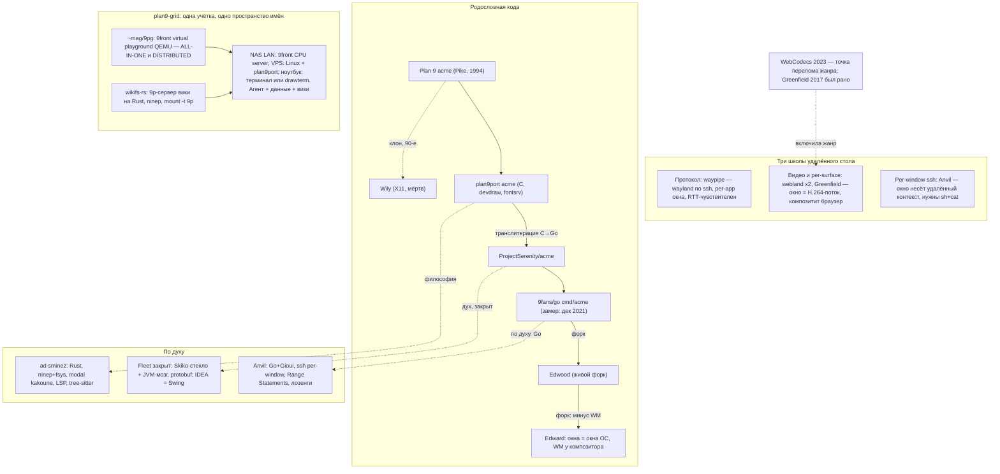

# Overview

Карта семейства acme и школ удалённости. Визуальная версия лежит рядом:
`editor-lineage.drawio` (открывается в draw.io). Этот mermaid рендерится
на GitHub и в любом mermaid-совместимом вьювере.

# Карта

# See also

- [editor-rendering-stacks](editor-rendering-stacks.md) — таблица слоёв
- [acme-remote-editing](acme-remote-editing.md) — три школы подробнее
- [fleet-split-pattern](fleet-split-pattern.md)
